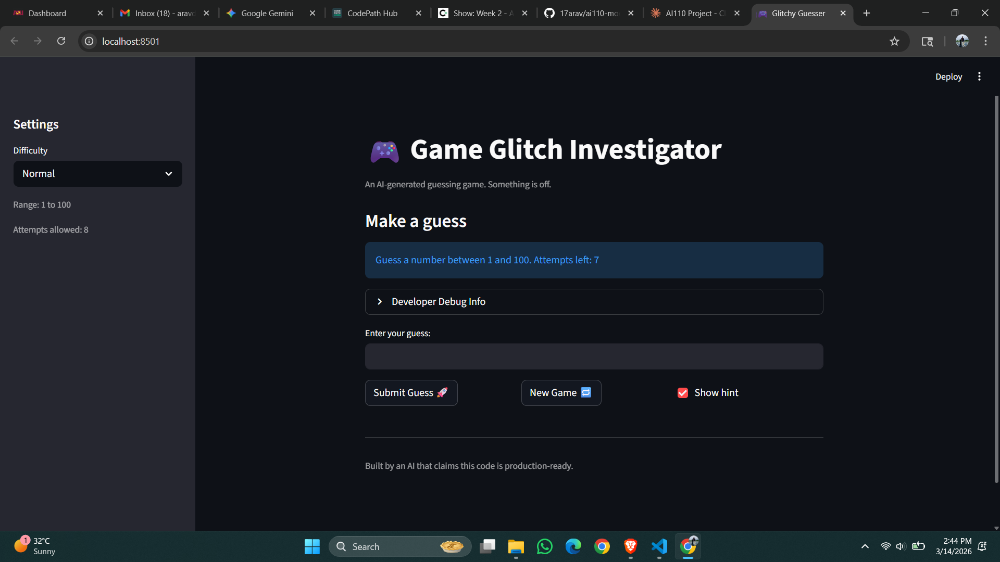
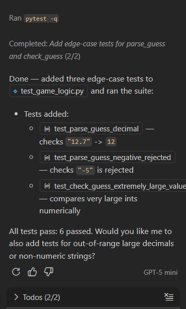
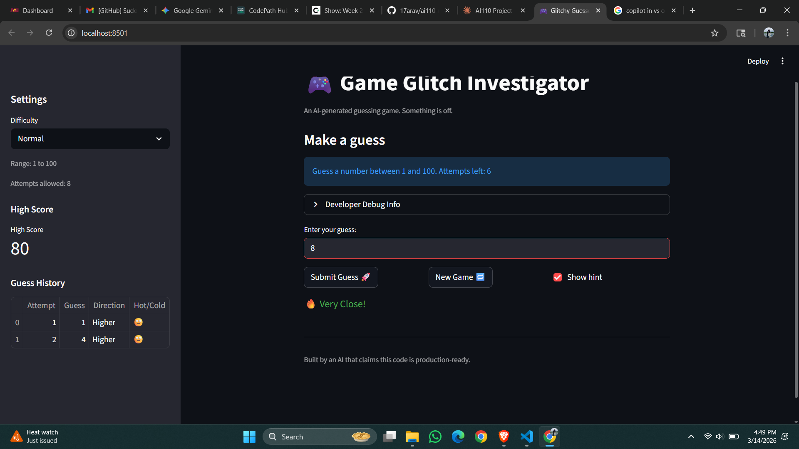

# 🎮 Game Glitch Investigator: The Impossible Guesser

## 🚨 The Situation

You asked an AI to build a simple "Number Guessing Game" using Streamlit.
It wrote the code, ran away, and now the game is unplayable. 

- You can't win.
- The hints lie to you.
- The secret number seems to have commitment issues.

## 🛠️ Setup

1. Install dependencies: `pip install -r requirements.txt`
2. Run the broken app: `python -m streamlit run app.py`

## 🕵️‍♂️ Your Mission

1. **Play the game.** Open the "Developer Debug Info" tab in the app to see the secret number. Try to win.
2. **Find the State Bug.** Why does the secret number change every time you click "Submit"? Ask ChatGPT: *"How do I keep a variable from resetting in Streamlit when I click a button?"*
3. **Fix the Logic.** The hints ("Higher/Lower") are wrong. Fix them.
4. **Refactor & Test.** - Move the logic into `logic_utils.py`.
   - Run `pytest` in your terminal.
   - Keep fixing until all tests pass!

## 📝 Document Your Experience

- [x] **Game's purpose:** This is a number guessing game built with Streamlit. The player tries to guess a secret number within a limited number of attempts, with hints guiding them higher or lower.
- [x] **Bugs found:** Hints were inverted (saying "Go HIGHER" when guess was too high), New Game button didn't reset game state properly, secret number was sometimes converted to a string causing wrong comparisons, and the Developer Debug Info was visible to players.
- [x] **Fixes applied:** Swapped the hint messages in check_guess, removed the string conversion of the secret number, added full state reset in the New Game handler, and refactored all game logic from app.py into logic_utils.py.

## 📸 Demo

- 

## 🚀 Stretch Features

- [x] **Challenge 1: Advanced Edge-Case Testing** — Added pytest tests for edge cases like negative numbers, decimals, and extremely large values.

- [x] **Challenge 2: Feature Expansion via Agent Mode** — Added a Guess History sidebar showing how close each guess was, and a High Score tracker that saves the best score to a file.

- [x] **Challenge 3: Professional Documentation and Linting** — Added PEP 257 docstrings to all functions in logic_utils.py and fixed PEP 8 style issues using Copilot.

- [x] **Challenge 4: Enhanced Game UI** — Added color-coded hints (green/yellow/red), Hot/Cold emojis, and a summary table at game end.

